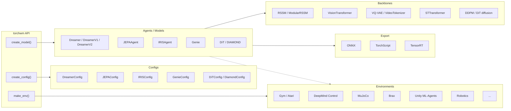

# TorchWM

<div align="center">
  <p>
    <a href="https://pypi.org/project/torchwm/"></a>
    <a href="https://pypi.org/project/torchwm/"></a>
    <a href="https://opensource.org/licenses/MIT"></a>
    <a href="https://paramthakkar123.github.io/torchwm/"></a>
    <a href="https://github.com/paramthakkar123/torchwm/actions/workflows/test.yml"></a>
  </p>
  <p><strong>Modular PyTorch library for world models — many algorithms, one consistent API.</strong></p>
</div>

**TorchWM brings the major world-model families together under a single PyTorch API.** Train Dreamer, PlaNet, JEPA, IRIS, DIAMOND, DiT, and Genie agents through `create_config` / `create_model` / `make_env`, or drop down to their encoders, decoders, and latent-dynamics backbones to compose your own architecture. Environment adapters (Gym/Gymnasium, DeepMind Control, MuJoCo, Brax, Atari, Unity ML-Agents) and ONNX / TorchScript / TensorRT export come built in.

## Quick Start

```bash
# Install the core package from PyPI.
# This keeps environment integrations and experiment logging optional.
pip install torchwm

# With extras
pip install torchwm[gym]       # Gym/Gymnasium environments (runnable quick start)
pip install torchwm[dmc]       # DeepMind Control Suite (walker-walk, cheetah-run, ...)
pip install torchwm[procgen]   # Procgen benchmark environments
pip install torchwm[ml-agents] # Unity ML-Agents
pip install torchwm[ml]        # TensorBoard, W&B logging
pip install torchwm[viz]       # Latent-space visualization (plotly, UMAP)
pip install torchwm[dev]       # Testing and linting

# Or add it to a uv-managed project.
uv add torchwm
```

TorchWM depends on PyTorch but does not force a single PyTorch wheel index. If you need a specific PyTorch build, install or add the PyTorch packages with the index recommended for your platform by the [PyTorch installation selector](https://pytorch.org/get-started/locally/):

```bash
# Example: CUDA 12.1 wheels. Choose a different index for CPU, ROCm, CUDA 11.x, CUDA 12.4+, or macOS.
uv add torch torchvision torchaudio --index https://download.pytorch.org/whl/cu121
```

Use the friendly top-level API for the common path. The example below runs on a
base `pip install torchwm[gym]` — no simulator downloads required:

```python
import torchwm

# Trains a Dreamer agent on a Gymnasium task. Bump `total_steps` for real runs.
agent = torchwm.create_model(
    "dreamer",
    env="Pendulum-v1",
    env_backend="gym",
    total_steps=5_000,
)
agent.train()
```

To train on DeepMind Control tasks such as `walker-walk`, install the DMC extra
(`pip install torchwm[dmc]`) and use the default backend:

```python
agent = torchwm.create_model("dreamer", env="walker-walk", total_steps=1_000_000)
agent.train()
```

### Swap the algorithm, keep the code

Every algorithm in the table below is reachable through the same factory, so
comparing them is a loop rather than a rewrite:

```python
import torchwm

for algo in ["dreamer-v1", "dreamer-v2", "dreamer-v3"]:
    agent = torchwm.create_model(
        algo, env="Pendulum-v1", env_backend="gym", total_steps=20_000
    )
    agent.train()
```

`examples/algorithm_comparison.py` runs exactly this and writes a comparison
plot. Construction is unified across all registered models. A shared
step-budget `train()` currently covers the Dreamer family — other agents use
their own trainers (`torchwm train …` / `JEPAAgent.train()` / `DiamondAgent.train()`).
The example reports which is which rather than assuming.

## Features

- Unified interfaces across world-model algorithms
- Modular encoders, decoders, dynamics models, and backbones
- Training and inference utilities for model-based reinforcement learning
- Environment integrations for Gym/Gymnasium, Unity ML-Agents, MuJoCo, Brax, and robotics extras
- Optional logging, visualization, development, and documentation extras

## Architecture



## Supported Algorithms

Every row is a registry entry — pass the name straight to `torchwm.create_model(...)`
or `torchwm.create_config(...)`. Run `torchwm.list_models()` for the live list.

| Name | Algorithm | Description | Key Features |
|------|-----------|-------------|--------------|
| `dreamer` | **Dreamer** | Model-based RL with latent dynamics (alias for `dreamer-v1`) | Imagination, actor-critic |
| `dreamer-v1` | **DreamerV1** | Latent imagination with Gaussian heads | Normal heads, standard KL |
| `dreamer-v2` | **DreamerV2** | Discrete latents for pixel control | Symlog two-hot heads, balanced KL |
| `dreamer-v3` | **DreamerV3 (name)** | Same `DreamerAgent` as `dreamer` | Registry name for V3-style configs; not a separate paper-complete V3 |
| `planet` | **PlaNet** | Latent planning from pixels, no explicit policy | RSSM, CEM planner |
| `modular-rssm` | **ModularRSSM** | Composable recurrent state-space model | Swappable priors/posteriors, custom heads |
| `iris` | **IRIS** | Sample-efficient RL with Transformers | Discrete VAEs, world models |
| `jepa` | **JEPA** | Self-supervised visual representations | Masked prediction, ViT |
| `dit` | **DiT** | Diffusion Transformer workflows | Patch embeddings, diffusion backbones |
| `diamond` | **DIAMOND** | Diffusion world model for pixel-control RL | EDM sampling, Atari imagination rollouts |
| `genie` | **Genie** | Generative interactive environments from video | Latent actions, spatiotemporal transformer |
| `genie-small` | **Genie (small)** | Development- and test-sized Genie | Same architecture, reduced width/depth |
| `genie-large` | **Genie (large)** | Scaled-up Genie variant | Higher capacity dynamics + tokenizer |

## Documentation

- [Full Documentation](https://paramthakkar123.github.io/torchwm/)
- [Installation Guide](https://paramthakkar123.github.io/torchwm/installation.html)
- [Training Guide](https://paramthakkar123.github.io/torchwm/training_guide.html)
- [API Reference](https://paramthakkar123.github.io/torchwm/api_reference.html)

## Community

- [Issue Tracker](https://github.com/paramthakkar123/torchwm/issues)
- [Discussions](https://github.com/paramthakkar123/torchwm/discussions)
- [PyPI](https://pypi.org/project/torchwm/)
- [Contributing Guide](CONTRIBUTING.md)
- [Code of Conduct](CODE_OF_CONDUCT.md)

> TorchWM follows [semantic versioning](https://semver.org/) as of 1.0.0. The
> public API — everything listed in the [Public API reference](https://paramthakkar123.github.io/torchwm/public_api.html)
> and re-exported from the top-level `torchwm` namespace — will not break within
> the 1.x line; anything removed gets a deprecation warning for at least one
> minor release first. Submodule internals not listed there may still change.
