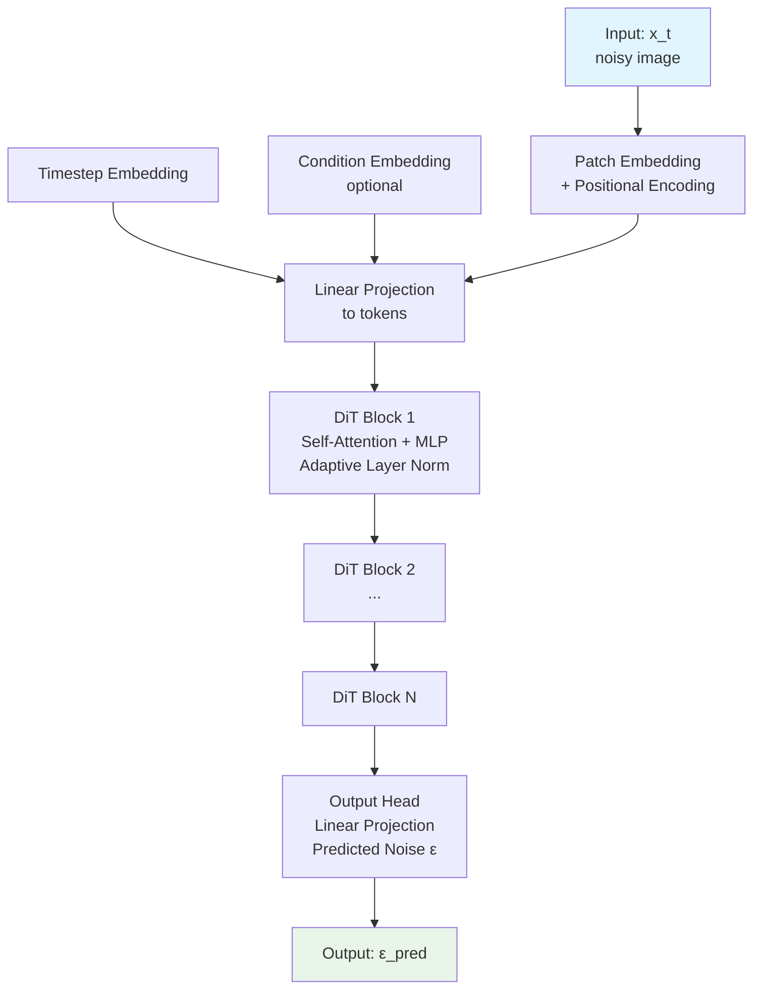

# DiT: Diffusion Transformer

DiT (Diffusion Transformer) applies the transformer architecture to diffusion models for image generation.
It treats diffusion as a sequence modeling problem where the transformer predicts noise at each timestep.

Based on paper: [Scalable Diffusion Models with Transformers](https://arxiv.org/abs/2212.09748) (Peebles & Xie, 2023)

## Key Idea

Instead of using CNNs (like U-Net) for diffusion, DiT uses a Vision Transformer (ViT) architecture:

1. **Tokenization**: Split image into patches, convert to tokens
2. **Diffusion as sequence**: Treat noise prediction as sequence modeling
3. **Transformer**: Process token sequence to predict added noise
4. **DDPM**: Generate images by iteratively denoising

## Architecture

<p align="center">
  
</p>
*Figure 1: DiT architecture overview from the DiT paper (Peebles & Xie, 2023). Shows the transformer-based diffusion model with patch embedding, timestep conditioning, and noise prediction.*


```

## Components

### 1. Patch Embedding

Converts input image into a sequence of tokens:
- Image of size `(C, H, W)` split into `(H/P × W/P)` patches
- Each patch linearly embedded to dimension `D`
- Add positional embeddings

```
x ∈ ℝ^{C×H×W} → tokens ∈ ℝ^{(H/P × W/P) × D}
```

### 2. Timestep & Condition Embeddings

- **Timestep**: sinusoial positional encoding for diffusion timestep `t`
- **Class label**: Optional conditioning for class-conditional generation
- Both added to each token

### 3. DiT Blocks

Transformer blocks with:
- **Self-attention**: Capture relationships between patches
- **MLP**: Process each patch independently
- **Adaptive Layer Norm (AdaLN)**: Condition on timestep/class

Variants:
- **AdaLN**: Adaptive Layer Norm
- **AdaLN-Single**: More parameter-efficient
- **AdaLN-Diagonal**: Condition variance too

### 4. Output Head

Final layer predicting noise (ε) same dimension as input:
```
ε_pred = Linear(tokens) → ℝ^{C×H×W}
```

## Training

```python
from world_models.configs import DiTConfig, get_dit_config

cfg = get_dit_config(
    DATASET="CIFAR10",
    BATCH=128,
    EPOCHS=100,
    IMG_SIZE=32,
    WIDTH=384,
    DEPTH=6,
)

# Training uses DDPM noise scheduling
# Forward: q(x_t | x_0) = N(√ᾱ_t x_0, (1-ᾱ_t)I)
# Reverse: p(x_{t-1} | x_t) = N(μ_θ(x_t,t), σ_t²I)
```

### Key Hyperparameters

| Parameter | Default | Description |
|-----------|---------|-------------|
| `IMG_SIZE` | 32 | Input image size |
| `PATCH` | 4 | Patch size |
| `WIDTH` | 384 | Transformer embedding dim |
| `DEPTH` | 6 | Number of blocks |
| `HEADS` | 6 | Attention heads |
| `TIMESTEPS` | 1000 | Diffusion steps |
| `BETA_START` | 1e-4 | Noise schedule start |
| `BETA_END` | 0.02 | Noise schedule end |

## Sampling (Generation)

```python
# Start from random noise
x_T ~ N(0, I)

# Iteratively denoise
for t in reversed(range(T)):
    ε = model(x_t, t)  # Predict noise
    x_{t-1} = x_t - √(1-ᾱ_t) * ε  # Remove predicted noise

# Output: x_0 (generated image)
```

### Classifier-Free Guidance

For conditional generation, use classifier-free guidance:
```
ε_cond = (1+w)·ε_model(x_t, c) - w·ε_model(x_t, ∅)
```
where `w` is guidance weight (typically 1-10).

## Comparison to CNN-Based Diffusion

| Aspect | U-Net (DDPM) | DiT (Transformer) |
|--------|-------------|-------------------|
| Architecture | CNN with skip connections | ViT |
| Global attention | Limited | Full |
| Scalability | Medium | High |
| Quality | Good | Slightly better |
| Compute | Efficient | Higher |

## Applications

1. **Image generation**: High-quality unconditional/class-conditional
2. **Image editing**: Inpainting, outpainting
3. **Video generation**: Temporal extension
4. **World models**: For model-based RL (as observation model)

## References

- Peebles, W., & Xie, S. (2023). Scalable Diffusion Models with Transformers.
