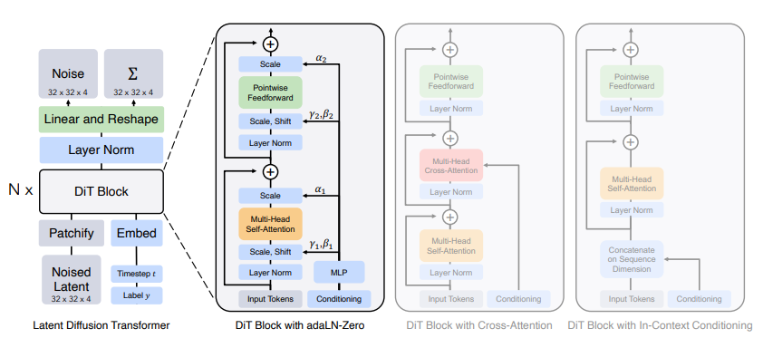

# DiT: Diffusion Transformer and Diffusion Models

This page covers the diffusion-based models in TorchWM: DDPM for image generation,
DiT for scalable transformer-based diffusion, and DIAMOND for diffusion world models
in reinforcement learning.

Based on papers:
- [Denoising Diffusion Probabilistic Models](https://arxiv.org/abs/2006.11239) (Ho et al., 2020)
- [Scalable Diffusion Models with Transformers](https://arxiv.org/abs/2212.09748) (Peebles & Xie, 2023)
- [DIAMOND: Diffusion as a Model of Environment Dreams](https://arxiv.org/abs/2403.05187) (Alonso et al., 2024)

```{contents} Contents
:depth: 3
```

## Overview

Diffusion models learn to generate data by reversing a gradual noising process.
In TorchWM, diffusion models serve two purposes:

1. **Image/video generation** (DDPM, DiT): High-quality unconditional or conditional sample generation.
2. **World models for RL** (DIAMOND): Diffusion-based dynamics models that predict future observations.

```{mermaid}
graph LR
    A["Data x₀"] --> B["Forward: q(x_t|x₀)"]
    B --> C["..."]
    C --> D["x_T ~ N(0, I)"]
    D --> E["Reverse: p_θ(x_{t-1}|x_t)"]
    E --> F["..."]
    F --> G["Generated x₀"]
```

## DDPM: Denoising Diffusion Probabilistic Models

### Forward Process

The forward (diffusion) process gradually adds Gaussian noise to data over `T`
timesteps according to a fixed variance schedule:

```{math}
q(x_t | x_{t-1}) = \mathcal{N}\left(\sqrt{1 - \beta_t}\, x_{t-1},\; \beta_t I\right)
```

We can sample `x_t` directly from `x_0`:

```{math}
q(x_t | x_0) = \mathcal{N}\left(\sqrt{\bar{\alpha}_t}\, x_0,\; (1 - \bar{\alpha}_t) I\right)
```

where `α_t = 1 - β_t` and `\bar{α}_t = ∏_{s=1}^{t} α_s`. Using the
reparameterization trick:

```{math}
x_t = \sqrt{\bar{\alpha}_t}\, x_0 + \sqrt{1 - \bar{\alpha}_t}\, \epsilon, \quad
\epsilon \sim \mathcal{N}(0, I)
```

### Reverse Process

The reverse process learns to denoise. Starting from pure noise `x_T ∼ N(0, I)`:

```{math}
p_θ(x_{t-1} | x_t) = \mathcal{N}\left(
\mu_θ(x_t, t),\; \sigma_t^2 I
\right)
```

### Training Objective

The simplified DDPM loss trains the model to predict the noise `ε` at each timestep:

```{math}
\mathcal{L}_{\text{DDPM}} = \mathbb{E}_{t, x_0, \epsilon}
\left[ \left\| \epsilon - \epsilon_θ\left(\sqrt{\bar{\alpha}_t}\, x_0 +
\sqrt{1 - \bar{\alpha}_t}\, \epsilon,\; t\right) \right\|^2 \right]
```

```python
x0 = batch                       # clean images
t = randint(0, T)                # random timestep
eps = randn_like(x0)             # random noise
xt = sqrt(alpha_bar[t]) * x0 + sqrt(1 - alpha_bar[t]) * eps
eps_pred = model(xt, t)          # predict noise
loss = mse(eps_pred, eps)        # simple noise-prediction loss
loss.backward()
```

### Sampling

```python
x = torch.randn(shape)           # pure noise
for t in reversed(range(T)):
    eps_pred = model(x, t)       # predict noise
    x = (x - sqrt(1 - alpha_bar[t]) * eps_pred) / sqrt(alpha_bar[t])
    if t > 0:
        x += sigma[t] * torch.randn_like(x)
return x                         # generated image
```

## DiT: Diffusion Transformer

DiT replaces the U-Net backbone with a Vision Transformer for noise prediction,
providing better scalability and global context.

### Architecture

<p align="center">
  
</p>

```{mermaid}
graph TD
    A["Noisy image x_t"] --> B["Patchify: (C,H,W) → (N,D)"]
    C["Timestep t"] --> D["Timestep embedding"]
    D --> E["AdaLN modulation"]
    B --> F["DiT Block × depth"]
    E --> F
    F --> G["..."]
    G --> H["Output head: (N,D) → (C,H,W)"]
    H --> I["Predicted noise ε_θ"]
```

### Patch Embedding

The input `x_t ∈ ℝ^{C×H×W}` is split into patches of size `P` and linearly embedded:

```{math}
x_t \in \mathbb{R}^{C \times H \times W}
\;\to\; \text{tokens} \in \mathbb{R}^{(H/P \cdot W/P) \times D}
```

For a 32×32 CIFAR-10 image with `P=4`: 64 tokens of dimension `D`.

### Timestep Conditioning (AdaLN)

DiT uses **Adaptive Layer Normalization** (AdaLN) to condition on the diffusion
timestep. The timestep embedding predicts the scale `γ` and shift `β` for each
block's layer norm:

```{math}
\text{AdaLN}(h, t) = γ(t) \cdot \text{LayerNorm}(h) + β(t)
```

| Variant | Scheme | Parameters | Speed |
|---------|--------|------------|-------|
| **AdaLN** | γ, β per block | Low | Default |
| **AdaLN-Single** | Shared γ, β | Very low | Fastest |
| **AdaLN-Diagonal** | γ, β + diagonal scaling | Medium | Medium |

### DiT Block

```{math}
\begin{aligned}
h &\leftarrow h + \text{MSA}(\text{AdaLN}(h, t)) \\
h &\leftarrow h + \text{MLP}(\text{AdaLN}(h, t))
\end{aligned}
```

No cross-attention — DiT is typically unconditional or class-conditional via AdaLN.

### Training

```python
from torchwm import DiTConfig, get_dit_config

cfg = get_dit_config(
    DATASET="CIFAR10",
    BATCH=128,
    EPOCHS=100,
    IMG_SIZE=32,
    WIDTH=384,
    DEPTH=6,
)
```

### Sampling (Generation)

```python
# Start from random noise, iteratively denoise
for t in reversed(range(T)):
    ε = model(x_t, t)  # Predict noise
    x_{t-1} = x_t - sqrt(1-alpha_bar_t) * ε
```

### Classifier-Free Guidance

For conditional generation:

```{math}
\epsilon_\mathrm{cond} = (1 + w) \cdot \epsilon_\mathrm{model}(\mathbf{x}_t, c)
- w \cdot \epsilon_\mathrm{model}(\mathbf{x}_t, \emptyset)
```

where `w` is guidance weight (typically 1-10).

## DIAMOND: Diffusion World Models

DIAMOND applies diffusion models to world modeling for reinforcement learning.
Instead of predicting latent states (Dreamer) or discrete tokens (IRIS), it
predicts future **observations** using a diffusion denoising process.

### Architecture

```{mermaid}
graph TD
    A["Past 4 frames"] --> B["Cond. encoder"]
    C["Action a_t"] --> B
    B --> D["Conditioning embedding c"]
    E["Noisy next frame x_t + ε"] --> F["Diffusion UNet"]
    D --> F
    F --> G["Denoised next frame x̂_t"]
    G --> H["Reward/Termination model"]
    H --> I["r̂_t, γ̂_t"]
    G --> J["Actor-Critic"]
```

### Key Components

| Component | File | Description |
|-----------|------|-------------|
| `DDPM` | `diffusion/DDPM.py` | Basic DDPM model and scheduler |
| `DiT` | `diffusion/DiT.py` | Diffusion Transformer |
| `DiffusionUNet` | `diffusion/diamond_diffusion.py` | Conditional UNet for DIAMOND |
| `EDMPreconditioner` | `diffusion/diamond_diffusion.py` | EDM-style noise preconditioning |
| `EulerSampler` | `diffusion/diamond_diffusion.py` | Fast ODE-based sampling |
| `RewardTerminationModel` | `diffusion/reward_termination.py` | Reward and termination prediction |
| `ActorCriticNetwork` | `diffusion/actor_critic.py` | Policy and value in imagination |

### EDM Preconditioning

DIAMOND uses the EDM (Elucidating Diffusion Model) formulation:

```{math}
D_θ(x, σ) = c_{\text{skip}}(σ) \cdot x + c_{\text{out}}(σ) \cdot
F_θ(c_{\text{in}}(σ) \cdot x, c_{\text{noise}}(σ))
```

This ensures the model always receives inputs scaled to unit variance and predicts
a scaled output that works well across all noise levels.

### Sampling

DIAMOND uses **Euler sampling** with very few steps (default 3) for fast inference:

```python
x = noise * sigma_max
for sigma in sigmas[:-1]:
    denoised = model(x, sigma, cond)
    d = (x - denoised) / sigma
    x = x + d * (sigma_next - sigma)
return denoised
```

## Usage in TorchWM

### DiT quick start

```python
from torchwm import DiTConfig, get_dit_config

cfg = get_dit_config(DATASET="CIFAR10", BATCH=128, EPOCHS=100, IMG_SIZE=32)
```

### DIAMOND quick start

```python
from torchwm import DiamondConfig

cfg = DiamondConfig(preset="small")  # small, medium, large
cfg.game = "Breakout-v5"
cfg.obs_size = 64
```

### DIAMOND CLI

```bash
torchwm train diamond --config world_models/configs/experiments/diamond.yaml \
    preset=small seed=1
```

Or directly:

```bash
python -m world_models.training.train_diamond --game Breakout-v5 --preset small
```

### DIAMOND Training Loop

```
for epoch in range(num_epochs):
    # 1. Collect real experience
    for step in range(environment_steps_per_epoch):
        action = select_action(obs)
        next_obs, reward, done = env.step(action)
        buffer.add(obs, action, reward, done, next_obs)
        obs = next_obs

    # 2. Train diffusion world model
    batch = buffer.sample(batch_size)
    loss = train_diffusion_step(batch)

    # 3. Train reward/termination model
    loss_r = train_reward_model(batch)

    # 4. Train actor-critic in imagination
    for step in range(imagination_horizon):
        action = actor(obs, hidden)
        next_obs = diffusion_model(obs, action, cond)
        reward = reward_model(next_obs)
        hidden = update_hidden(hidden, action, next_obs)
    actor_loss, critic_loss = compute_ac_loss(imagination_trajectory)
```

See {doc}`configs_reference` for the full DiTConfig and DiamondConfig field reference with defaults. |

## Sampling Methods

| Method | Steps | Quality | Speed |
|--------|-------|---------|-------|
| DDPM | 1000 | Best | Slow |
| DDIM | 50–100 | Good | Fast |
| Euler | 3–10 | Fair for RL | Very fast |
| DPM-Solver | 10–20 | Excellent | Fast |

## Comparison: DiT vs CNN-Based Diffusion

| Aspect | U-Net (DDPM) | DiT (Transformer) |
|--------|-------------|-------------------|
| Architecture | CNN with skip connections | ViT |
| Global attention | Limited | Full |
| Scalability | Medium | High |
| Quality | Good | Slightly better |
| Compute | Efficient | Higher |

## Common Pitfalls

### Slow sampling

DDPM with 1000 steps is too slow for RL training loops.

**Fixes:**
- Use Euler sampler with 3–10 steps (DIAMOND default)
- Use DDIM for higher quality with ~50 steps

### Training instability

Diffusion UNets can produce NaN during training.

**Fixes:**
- Enable gradient clipping
- Use EDM preconditioning

### Blurry generations

Low sampling steps produce blurry results.

**Fixes:**
- Increase `num_sampling_steps`
- Add classifier-free guidance
- Train with more diffusion timesteps

## See Also

- {doc}`dreamer` — continuous world model alternative using RSSM
- {doc}`iris` — discrete world model alternative using transformers
- {doc}`vision_guide` — diffusion model components (PatchEmbed, DDPM)

## References

- Ho, J., Jain, A., & Abbeel, P. (2020). Denoising Diffusion Probabilistic Models. *NeurIPS 2020.*
- Peebles, W., & Xie, S. (2023). Scalable Diffusion Models with Transformers. *ICCV 2023.*
- Alonso, E., et al. (2024). DIAMOND: Diffusion as a Model of Environment Dreams. *ICLR 2024.*
- Song, J., Meng, C., & Ermon, S. (2021). Denoising Diffusion Implicit Models. *ICLR 2021.*
- Karras, T., et al. (2022). Elucidating the Design Space of Diffusion-Based Generative Models. *NeurIPS 2022.*
